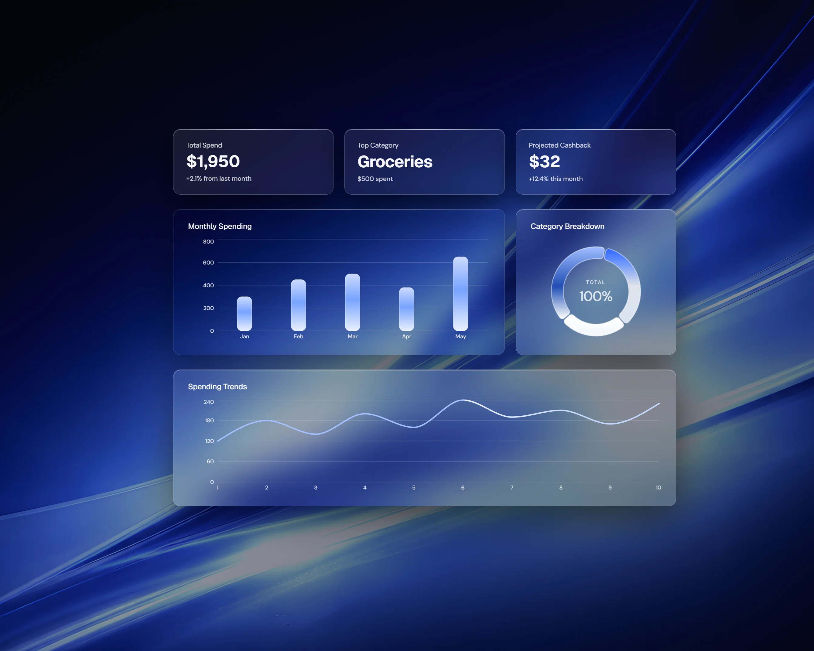

# Aether

---

## Overview

Aether is a personal finance dashboard focused on isolating signal from financial data.  
It surfaces spending behavior category distribution and reward efficiency to support clearer decisions.

[View](https://aether.vmoreira.dev)

---

## Analysis

- Spending patterns over time  
- Category concentration and drift  
- Credit-card reward efficiency  
- Trend visibility without clutter  

---

## Stack

- Next.js  
- TypeScript  
- Tailwind CSS  
- Prisma ORM  
- PostgreSQL  
- Recharts  
