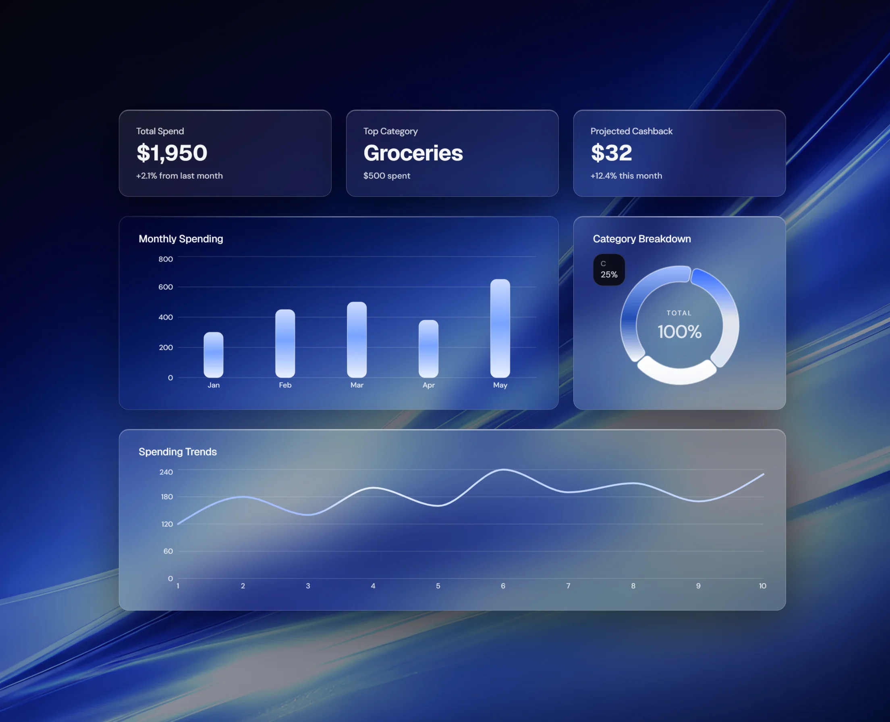

# Aether

A financial insights dashboard for tracking spending, analyzing trends, and optimizing credit rewards

---

## Overview

Aether is a streamlined personal finance dashboard built for clarity and decision-making. It visualizes spending behavior, category trends, and credit-card reward optimization to give users a real-time financial control layer.

---

## Live Demo

https://aether.vmoreira.dev

---

## Stack

- Next.js  
- TypeScript  
- Tailwind CSS  
- shadcn/ui  
- Prisma ORM  
- PostgreSQL  
- Recharts  

---

## Features

- CSV transaction upload with automatic parsing  
- Editable category detection and management  
- Monthly spending charts and trend breakdowns  
- Credit-card reward optimization engine  
- Detailed card profiles with reward structures  
- Fully responsive dashboard layout  
- Modular, scalable codebase  
